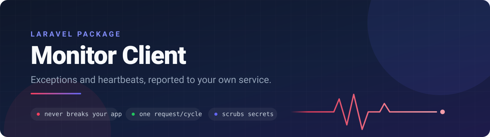

<p align="center">
    
</p>

<p align="center">
    <a href="https://github.com/marekmiklusek/laravel-monitor-client/actions"></a>
    <a href="https://packagist.org/packages/marekmiklusek/laravel-monitor-client"></a>
    <a href="https://packagist.org/packages/marekmiklusek/laravel-monitor-client"></a>
    
    <a href="LICENSE.md"></a>
</p>

Laravel client that reports uncaught exceptions, failed queue jobs, error-level
log records and periodic heartbeats to a self-hosted monitoring service. The server side lives at
[marekmiklusek/monitor](https://github.com/marekmiklusek/monitor) – install
that first, then point this client at it via `MONITOR_URL`.

The package is built around a single rule: **it must never break or slow down
the host application**. Every network call, every serialisation step and even
the package boot itself is wrapped in a `try/catch` that fails silently. A lost
report is always preferable to a 500 in production. Silenced failures are not
invisible, though – they are written to the application log (see
[Failure logging](#failure-logging)).

## Requirements

- PHP 8.4+
- Laravel 13

## Installation

```bash
composer require marekmiklusek/laravel-monitor-client
```

Publish the config file:

```bash
php artisan vendor:publish --tag=monitor-config
```

### Local development with a path repository

To work on the package and a host application at the same time, point Composer
at your local checkout. With `"symlink": true` the package directory is
symlinked into `vendor/`, so edits are picked up immediately without reinstalling.

```json
{
    "repositories": [
        {
            "type": "path",
            "url": "../laravel-monitor-client",
            "options": {
                "symlink": true
            }
        }
    ],
    "require": {
        "marekmiklusek/laravel-monitor-client": "*"
    }
}
```

## Heartbeats require the scheduler

The package registers `monitor:heartbeat` into the Laravel scheduler
**automatically** – every 5 minutes, and only while the package is enabled
for the current environment. There is nothing to add to your own schedule.

What you **must** provide is a running scheduler on the host server:

```cron
* * * * * php artisan schedule:run
```

> **Ignore this and heartbeats are never sent, so the monitoring service
> will keep reporting the project as down even though it is perfectly
> healthy.** This is the single most common cause of false alerts.

Verify that the heartbeat is registered:

```bash
php artisan schedule:list
```

`php artisan monitor:test` reports the same thing as part of its output.

A side effect worth knowing: because heartbeats go through the scheduler,
they implicitly monitor your cron as well. If cron dies on the server,
heartbeats stop and the monitoring service raises an alert.

## Configuration

All settings are read through `config('monitor.*')`. The package never calls
`env()` outside of `config/monitor.php`, so it keeps working under
`php artisan config:cache`.

| Env variable      | Config key         | Default        | Description                                       |
|-------------------|--------------------|----------------|---------------------------------------------------|
| `MONITOR_URL`     | `monitor.url`      | `null`         | Endpoint that receives the payload                |
| `MONITOR_TOKEN`   | `monitor.token`    | `null`         | Sent as `Authorization: Bearer <token>`           |
| `MONITOR_ENABLED` | `monitor.enabled`  | `false`        | Master switch, off by default                     |

```dotenv
MONITOR_ENABLED=true
MONITOR_URL=https://monitor.example.com/api/events
MONITOR_TOKEN=your-token-here
```

Config-only options (no env variable):

| Key                          | Default                                                                                       | Description                                            |
|------------------------------|-----------------------------------------------------------------------------------------------|--------------------------------------------------------|
| `monitor.environments`       | `['production']`                                                                              | Environments the package is active in                  |
| `monitor.timeout`            | `2`                                                                                           | HTTP timeout in seconds, no retries                    |
| `monitor.auto_register`      | `true`                                                                                        | Hook into the exception handler automatically          |
| `monitor.collect_input`      | `true`                                                                                        | Collect request input and command arguments into the context |
| `monitor.collect_failed_jobs` | `true`                                                                                       | Report failed queue jobs as `failed_job` occurrences   |
| `monitor.collect_logs`       | `true`                                                                                        | Report log records as `log` occurrences                |
| `monitor.log_level`          | `error`                                                                                       | Lowest level reported as a `log` occurrence            |
| `monitor.collect_breadcrumbs` | `true`                                                                                       | Keep a buffer of recent log records and attach it to failures |
| `monitor.breadcrumbs_limit`  | `30`                                                                                          | How many breadcrumbs are kept, `0` disables them       |
| `monitor.max_occurrences_per_request` | `100`                                                                                | Occurrences per HTTP request, the buffer is sent in batches |
| `monitor.max_payload_kilobytes` | `400`                                                                                      | Serialised size per HTTP request, kept under the 512 KB cap |
| `monitor.max_message_length` | `8000`                                                                                        | Characters per message, kept under the central's 10000 cap |
| `monitor.max_buffered_occurrences` | `200`                                                                                   | Buffer ceiling, everything past it is dropped and counted |
| `monitor.log_channel`        | `null`                                                                                        | Channel for silenced-failure warnings, `null` = default |
| `monitor.log_throttle_minutes` | `5`                                                                                         | Same failure type is logged at most once per window    |
| `monitor.ignored_exceptions` | `NotFoundHttpException`, `ValidationException`, `AuthenticationException`, `AuthorizationException` | Matched with `instanceof`, so subclasses are ignored too |
| `monitor.scrub_keys`         | `password`, `password_confirmation`, `token`, `secret`, `authorization`, `api_key`, `credit_card` | Replaced with `[REDACTED]`, case insensitive, at any depth |

**Nothing is collected at all** unless `monitor.enabled` is true, a URL is set,
and the current environment is listed in `monitor.environments`. Installing the
package therefore never changes behaviour on its own.

### Verify the installation

After setting the `MONITOR_` variables, confirm the application can actually
reach the monitoring service:

```bash
php artisan monitor:test
```

The command sends one test occurrence and prints the result **loudly** – it is the
only place in the package where errors are not silenced. On success it prints
the HTTP status; on failure it prints the concrete reason (connection error,
status code, response body). It runs even when `monitor.enabled` is false, so
it can be used before switching the package on. A non-zero exit code makes it
usable in deploy scripts.

After a successful send the command also prints whether **live reporting** is
active: if the package is disabled or the current environment is not listed in
`monitor.environments`, it warns that connectivity is OK but real exceptions
are not being reported. Connectivity and live collection are two different
things – a green test does not mean exceptions are flowing.

### Failure logging

Every silenced failure – a rejected or failed HTTP request, a serialisation
error, a broken boot – is written to the log as a `warning`:

- channel comes from `monitor.log_channel` (`null` = application default),
- the same failure type is logged at most once per `monitor.log_throttle_minutes`
  (default 5), so an unreachable monitoring service cannot flood the log,
- if the cache is unavailable, throttling is skipped and the warning is logged
  anyway,
- while a warning is being written the package collects nothing, so a failure
  inside logging can never loop back into the reporter.

If exceptions stop arriving at the central service, check the host
application's log for `Laravel Monitor client` warnings first, then run
`php artisan monitor:test`.

## What is collected

| Occurrence type | Source                                    | Switch                          |
|-----------------|-------------------------------------------|---------------------------------|
| `exception`     | Uncaught exceptions via the reportable chain | always on while the package runs |
| `failed_job`    | `Illuminate\Queue\Events\JobFailed`       | `monitor.collect_failed_jobs`   |
| `log`           | `Illuminate\Log\Events\MessageLogged`, level `monitor.log_level` and above | `monitor.collect_logs` |
| `heartbeat`     | `monitor:heartbeat` on the scheduler      | always on while the package runs |

Exceptions and failed jobs additionally carry **breadcrumbs** – the last log
records of any level – when `monitor.collect_breadcrumbs` is on.

### Failed jobs

Every `JobFailed` event is reported as a `failed_job` occurrence: the exception
that killed the job (class, message, file, line, 30 stack frames) plus a context
with the job class, connection, queue, attempt count and the job payload. The
payload goes through the same `Scrubber` and the same limits as request input –
max depth 3, max 100 keys, values truncated to 1000 characters, objects replaced
with `[OBJECT]`.

`JobFailed` also flushes the buffer, so a failed job leaves the worker as one
HTTP request.

### Log events

Log records at `monitor.log_level` or above become `log` occurrences with the
level, the message, the channel and the scrubbed context. The default threshold
is `error`, so `error`, `critical`, `alert` and `emergency` are reported and
everything below is not. An unknown value in `monitor.log_level` falls back to
`error`.

`channel` is the application's `logging.default`, not the channel a particular
record was written to: `MessageLogged` does not carry that information.

The message is cut to `monitor.max_message_length` and the context to 100
entries – see [Buffer limits](#buffer-limits).

> **The package never collects its own log output.** Silenced failures are
> written through the `Silencer`, which raises a static flag for the duration of
> the write; while that flag is up nothing is buffered – no log occurrence, no
> breadcrumb, no exception. A monitoring service that keeps rejecting requests
> therefore logs a warning and stops there, instead of feeding itself.

### Breadcrumbs

Breadcrumbs are a circular buffer of the last `monitor.breadcrumbs_limit` log
records (default 30) of **every** level, including `debug` and `info`. They are
never sent on their own: if the request or the job finishes without a failure,
the buffer is thrown away at the flush that ends it. That matters most in a
long-lived queue worker, where the trail of a job that succeeded must never be
attached to a job that fails later.

When an exception or a failed job is buffered, the breadcrumbs collected so far
are attached to that occurrence as a `breadcrumbs` array, each entry carrying
`level`, `message`, scrubbed `context` and `logged_at`. The key is omitted
entirely when there is nothing to attach.

An `error` record therefore travels twice – once as a `log` occurrence and once
as a breadcrumb on whatever fails afterwards. That is intentional: the log
occurrence is the event, the breadcrumb is the trail leading to the failure.
The two are separate payload entries, so nothing is sent twice as the same
occurrence.

Set `monitor.breadcrumbs_limit` to `0` (or `monitor.collect_breadcrumbs` to
`false`) to switch the buffer off entirely.

### Buffer limits

The monitoring service accepts at most 100 occurrences and 512 KB per request,
so the client keeps itself inside those caps:

- **Batching.** On flush the buffer is split into batches and each batch is
  sent as its own HTTP request. A batch is closed when it reaches
  `monitor.max_occurrences_per_request` (default 100) **or** when the next
  occurrence would push the serialised JSON over
  `monitor.max_payload_kilobytes` (default 400, leaving headroom under the
  512 KB cap) – whichever comes first. 250 buffered log events therefore leave
  as three requests, and a handful of occurrences with large contexts can leave
  as several without ever reaching the count limit.
- **Message length.** Every message – on the occurrence itself and on each
  breadcrumb – is cut to `monitor.max_message_length` (default 8000, under the
  central's 10000 character cap) with a `... [truncated, N chars omitted]`
  marker. This happens **always**, not only when the payload is too large: the
  central validates each record and rejects the whole batch with a 422 when
  one message is over.
- **Context entries.** Log and breadcrumb contexts are capped at 100 entries,
  the same limit the central validates against, with the last slot spent on a
  `[truncated]` marker naming how many were omitted. Request input and job
  payloads were already capped at 100 keys when they were collected.
- **Truncation.** An occurrence too large to fit a batch on its own is never
  dropped. It is shrunk in order – breadcrumbs first, then the stack down to
  10 frames, then the context – and stops as soon as it fits. Whatever is sent
  carries `"truncated": true` so the gap is visible in the central service. An
  occurrence that stays oversized even with nothing left to shed is still
  sent, still flagged: a truncated report beats no report.
- **Ceiling.** Once the buffer holds `monitor.max_buffered_occurrences`
  (default 200), collection stops and everything further is counted instead of
  kept. A runaway loop cannot grow the buffer without bound.
- **Visible loss.** The dropped count is not only logged locally. The last
  batch carries an extra `log` occurrence at `warning` level with the message
  `monitor: dropped N occurrences over buffer limit`, so the gap is visible in
  the central service. The counter resets with each flush.
- **Encoding.** Strings that are not valid UTF-8 are repaired before the
  payload is built. Without that a single malformed byte – a binary blob in a
  log context, a corrupted input – would make `json_encode` fail and take the
  whole batch down with it.
- **Batch isolation.** Each batch is sent inside its own `try/catch`, so a
  transport that fails on one batch does not stop the batches behind it.
- **Failures beat noise.** When the buffer is full and an exception or a failed
  job arrives, the **oldest log occurrence** is evicted to make room for it
  (and counted as dropped). A crashed request is never lost to noisy logging.
  An exception is dropped only when the buffer holds nothing but other
  failures.

## How it works

Occurrences are collected into an in-memory buffer during a request and shipped
from a `terminating` callback – in a **single** HTTP request unless the buffer
outgrows the [batch limits](#buffer-limits), in which case it goes out in
batches. In contexts where `terminating` is not reliable, the buffer is flushed
on:

- `CommandFinished` – end of an Artisan command
- `JobExceptionOccurred` – every failed attempt, not just the final one
- `JobProcessed` / `JobFailed` – end of a queued job
- `WorkerStopping` – `queue:restart`, so a partial buffer still ships

The buffer is keyed by the throwable instance itself (`SplObjectStorage`), so
the same exception reported twice only ever produces one occurrence.

### Registering the exception hook

By default the service provider attaches itself to the framework exception
handler and there is nothing to do.

If you prefer to wire it up explicitly, set `monitor.auto_register` to `false`
and register it in `bootstrap/app.php`. Note the explicit import – the facade is
deliberately **not** registered as a global `\Monitor` alias, to avoid colliding
with a class of the same name in your application.

```php
use MarekMiklusek\MonitorClient\Facades\Monitor;

return Application::configure(basePath: dirname(__DIR__))
    ->withExceptions(function (Exceptions $exceptions): void {
        Monitor::handles($exceptions);
    })
    ->create();
```

Calling `Monitor::handles()` while auto-registration is still on is harmless:
an internal flag guarantees a single registration regardless of call order, so
no exception is ever reported twice.

> **Exceptions listed in your application's `dontReport` never reach the
> monitoring service.** The package hooks into the reportable chain, which the
> framework skips entirely for ignored exception types. If you need to see one
> of those centrally, remove it from `dontReport` and add it to
> `monitor.ignored_exceptions` instead – or leave it out of both.

### Heartbeat

The service provider schedules `monitor:heartbeat` every five minutes, but only
when the package is enabled for the current environment. Make sure the host
application runs the scheduler.

You can also send one by hand:

```bash
php artisan monitor:heartbeat
```

## Payload

```json
{
  "schema_version": 1,
  "sent_at": "2026-08-06T12:34:56+00:00",
  "environment": "production",
  "occurrences": [
    {
      "type": "exception",
      "occurred_at": "2026-08-06T12:34:55+00:00",
      "exception_class": "RuntimeException",
      "message": "Something went wrong",
      "file": "/app/Http/Controllers/OrderController.php",
      "line": 42,
      "stack": [
        {
          "file": "/app/Http/Controllers/OrderController.php",
          "line": 42,
          "function": "store",
          "class": "App\\Http\\Controllers\\OrderController"
        }
      ],
      "context": {
        "url": "https://example.com/orders",
        "method": "POST",
        "user_id": 1,
        "headers": {
          "accept": "application/json",
          "user-agent": "Mozilla/5.0"
        },
        "input": {
          "email": "customer@example.com",
          "password": "[REDACTED]",
          "attachment": "[FILE invoice.pdf, 48211 B]"
        }
      },
      "breadcrumbs": [
        {
          "level": "info",
          "message": "Checkout started",
          "context": {"order_id": 4711},
          "logged_at": "2026-08-06T12:34:50+00:00"
        }
      ]
    },
    {
      "type": "failed_job",
      "occurred_at": "2026-08-06T12:34:55+00:00",
      "exception_class": "RuntimeException",
      "message": "The payment gateway timed out",
      "file": "/app/Jobs/ChargeOrder.php",
      "line": 61,
      "stack": [],
      "context": {
        "job": "App\\Jobs\\ChargeOrder",
        "connection": "redis",
        "queue": "payments",
        "attempts": 3,
        "payload": {
          "uuid": "9f1c...",
          "displayName": "App\\Jobs\\ChargeOrder"
        }
      }
    },
    {
      "type": "log",
      "occurred_at": "2026-08-06T12:34:54+00:00",
      "level": "error",
      "message": "Payment gateway unreachable",
      "channel": "stack",
      "context": {
        "gateway": "acme-pay",
        "api_key": "[REDACTED]"
      }
    }
  ]
}
```

Stack traces are truncated to 30 frames. Frame **arguments are never sent** –
they routinely contain passwords and tokens and cannot be serialised reliably.

`breadcrumbs` is present only on `exception` and `failed_job` occurrences, and
only when at least one breadcrumb was recorded.

A `"truncated": true` key marks an occurrence the client had to shrink – either
to keep the request under `monitor.max_payload_kilobytes` or to bring a message
within `monitor.max_message_length`. It is absent on everything that went out
whole.

### Adding new occurrence types

`type` is backed by the `OccurrenceType` enum, and every occurrence is a
subclass of `MonitorOccurrence` that renders its own `payload()`. Slow queries
or scheduled-task failures are added by introducing a new enum case and a new
subclass – the buffer, the payload envelope and the transport stay untouched.
That is exactly how `failed_job` and `log` were added, without touching
`schema_version`.

Besides `url`, `method` and `user_id`, the context carries the request
`input` (query + body, max depth 3, max 100 keys, values truncated to
1000 characters, uploads replaced with a `[FILE <name>, <size> B]`
placeholder) and a whitelist of `headers` (`accept`, `content-type`,
`user-agent`, `referer`, `origin`, `x-request-id`). In console context
`input` is replaced by `command` with the artisan command name and its
arguments. Set `monitor.collect_input` to `false` to collect neither
input nor command arguments.

`url` and every collected header are truncated to 1000 characters as well –
after their query strings are redacted, never before, so a long URL cannot
push a secret past the cut.

## Security

Values of keys listed in `monitor.scrub_keys` are replaced with `[REDACTED]`
before anything leaves the application. Matching is case insensitive and
recursive through the whole context, including request input, command
arguments, failed job payloads, log context and breadcrumb context. Matching
works on array keys, which is why objects are collapsed to `[OBJECT]` rather
than serialised – see below.

**Query strings are scrubbed too.** A secret passed in the URL rather than the
body – `?api_key=…`, a password-reset `?token=…`, a signed `?signature=…` –
would otherwise travel in plain sight inside `context.url`, past a scrub list
that only ever sees array keys. Matching parameters are redacted in the
collected URL and in the `referer` and `origin` headers, which carry the URL of
a *different* page and are a common way for a one-time token to escape.

The `authorization` and `cookie` headers are **never collected** – not even
in redacted form, they simply are not read. Uploaded files are represented
only by name and size; their content never leaves the application.

**Objects never leave as objects.** Anything that is not a scalar or an array –
an Eloquent model dropped into a log context, a DTO, a value object – is
replaced with `[OBJECT]` before it is serialised. Without that, `json_encode`
would unfold its public properties and ship whatever they hold, past the
`scrub_keys` list, which only ever sees array keys. `Stringable` values are
kept as their string (truncated to 1000 characters), dates as ATOM strings and
enums as their value or name, because those are bounded and safe.

## Testing

```bash
composer test
```

## License

MIT. See [LICENSE.md](LICENSE.md).
